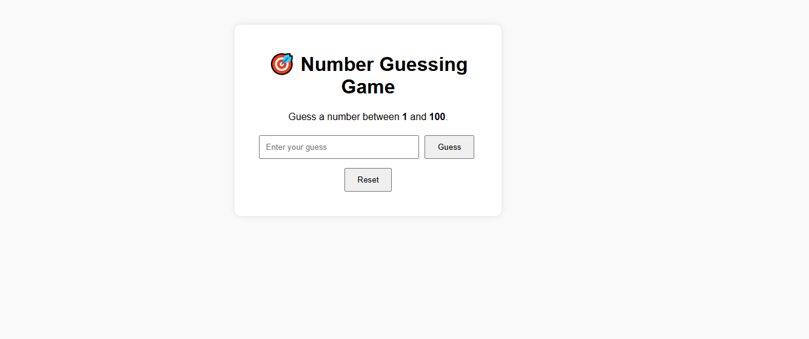

# 📝 Number Guessing Game

Un petit jeu interactif où l'utilisateur tente de deviner un nombre secret choisi aléatoirement par l'ordinateur.

---

## 📋 Description générale

Number Guessing Game est un jeu web simple dans lequel :

L’ordinateur choisit un nombre aléatoire entre deux bornes (par exemple : 1 et 100).

Le joueur essaie de deviner ce nombre.

Après chaque tentative, le jeu donne un indice :

🔼 "Too high" (Trop haut)

🔽 "Too low" (Trop bas)

✅ "Correct!" (Bonne réponse)

Le jeu peut suivre :

Le nombre d'essais

Les tentatives précédentes

Une victoire ou une défaite après un nombre maximum d'essais (optionnel)

---

## 🚀 Fonctionnalités principales

🎲 Génération d’un nombre aléatoire secret

🎯 Entrée utilisateur pour proposer une valeur

💡 Feedback interactif selon la proposition

🔁 Possibilité de recommencer une nouvelle partie

🧠 Compteur d’essais (optionnel)

📱 Interface responsive

---

## 🛠️ Technologies utilisées

- 🌐 **HTML5** pour la structure
- 🎨 **CSS3/Bootstrap5** pour le style
- ⚙️ **JavaScript / jQuery** pour la logique

---

## 📸 Capture d'écran

Ajoute ici une capture si tu veux :



## 🔗 Démo en ligne

👉 [Clique ici pour essayer Number Guessing Game](https://projectsjavascript.github.io/Number-Guessing-Game/)

## 📁 Structure du projet

```
Number-Guessing-Game/
├──JQuery
    ├──jquery-3.7.1.min.js
├── index.html
├── screenshot.png
├── script.js
└── README.md
```

## 📄 Licence

Ce projet est open-source sous licence MIT.

### 🌐 Langue / Language

- 🇫🇷 [Lire en Français](./README.fr.md)
- 🇬🇧 [Read in English](./README.md)
