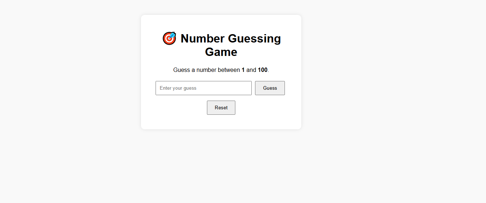

# 📝 Number Guessing Game

A small interactive game where the user tries to guess a secret number randomly selected by the computer.

---

## 📋 General Description

**Number Guessing Game** is a simple web game where:

- The computer selects a random number between two bounds (e.g., 1 and 100).
- The player attempts to guess the number.
- After each guess, the game provides a hint:

  🔼 "Too high"

  🔽 "Too low"

  ✅ "Correct!"

The game can also keep track of:

- The number of attempts
- Previous guesses
- A win or loss after a maximum number of tries (optional)

---

## 🚀 Main Features

🎲 Generation of a secret random number  
🎯 User input to submit a guess  
💡 Interactive feedback based on the guess  
🔁 Option to restart the game  
🧠 Attempt counter (optional)  
📱 Responsive interface

---

## 🛠️ Technologies Used

- 🌐 **HTML5** for structure
- 🎨 **CSS3/Bootstrap5** for styling
- ⚙️ **JavaScript / jQuery** for logic

---

## 📸 Screenshot

Add a screenshot here if you'd like:



## 🔗 Live Demo

👉 [Click here to try Number Guessing Game](https://projectsjavascript.github.io/Number-Guessing-Game/)

---

## 📁 Project Structure

```
Number-Guessing-Game/
├──JQuery
    ├──jquery-3.7.1.min.js
├── index.html
├── screenshot.png
├── script.js
└── README.md
```

---

## 📄 License

This project is open-source under the MIT license.

### 🌐 Language

- 🇫🇷 [Lire en Français](./README.fr.md)
- 🇬🇧 [Read in English](./README.md)
